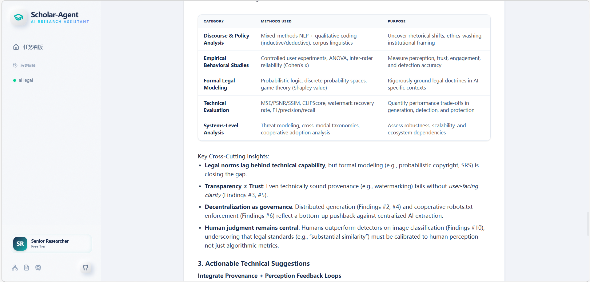

<div align="center">


# 🎓 Scholar-Agent
**Fully Automated Academic Research Assistant**

[](https://www.python.org/downloads/)
[](https://fastapi.tiangolo.com/)
[](https://reactjs.org/)
[](https://langchain-ai.github.io/langgraph/)
[](https://www.docker.com/)
[](https://www.gnu.org/licenses/gpl-3.0)

[English](README.md) • [简体中文](README_zh.md)

<p align="center">
    <strong>Scholar-Agent can automatically retrieve, filter, and analyze cutting-edge research papers from the web and your local Zotero library, extracting quantified state-of-the-art (SOTA) comparison data and technical recommendations.</strong>
</p>
</div>

---

## 📺 Demo videos and screenshots  

**Click to watch the full tutorial video on Bilibili:**

[](https://www.bilibili.com/video/BV1AmwxzPEBF)

<div align="center">
  
  <br />
  <i>Real-time Agent Tracking: Watch every step of the reasoning pipeline via WebSockets</i>
</div>

---

<div align="center">
  
  <br />
</div>

---

<div align="center">
  
  <br />
</div>

---

<div align="center">
  
  <br />
</div>

---

<div align="center">
  
  <br />
</div>

---
## 🚀 Quick start

### 1. Environment variable configuration
```bash
# Copy the default environment variable template  
cp .env.example .env
```
---

## ⚙️ Core environment variable description

All core configuration settings are centralized in the `.env` configuration file located in the `backend` directory:

| Variable | Description |
|---|---|
| `OPENAI_API_KEY` | OpenAI Official API Key, used to drive core Agent decision-making and reasoning logic. |
| `ZOTERO_API_KEY` | Zotero Personal Account API Key, used to remotely read literature library data.|
| `ZOTERO_USER_ID` | Your Zotero User ID, used to locate specific personal/group libraries. |
| `EXPERIMENT_CSV_PATH` | Used to specify the storage directory of the generated quantitative analysis CSV file. (Optional) |
---

## 2.  Local development environment setup

Since the architecture upgrade, the system now requires several components to run in parallel:

### Step 1: Ensure Redis is started (The Cornerstone)
```powershell
cd redis
.\redis-server.exe
```

---

### Step 2: Start FastAPI Gateway (Terminal 1)
This is the central hub for all API requests.
```powershell
# 1. Enter the backend directory
cd backend

# 2. Activate the virtual environment
.\venv\Scripts\Activate.ps1

# 3. Start the service
python -m uvicorn server:app --reload
```
🔔 **Success Criteria**: Terminal shows `Uvicorn running on http://127.0.0.1:8000`

---

### Step 3: Start Celery Computing Cluster (Terminal 2)
This handles the heavy lifting: PDF parsing and Agent reasoning.
```powershell
# 1. Enter the backend directory
cd backend

# 2. Activate the virtual environment
.\venv\Scripts\Activate.ps1

# 3. Start the worker (Note: --pool=solo is required on Windows)
celery -A celery_app worker --loglevel=info --pool=solo
```
🔔 **Success Criteria**: Terminal shows the pyramid icon and `[celery@...] ready.`

---

### Step 4: Start the Frontend Interface (Terminal 3)
```powershell
# 1. Enter the frontend directory
cd frontend

# 2. Install dependencies (First time only)
npm install

# 3. Run development server
npm run dev
```
🔔 **Success Criteria**: Terminal shows `VITE v5.x.x ready in ...` and the link `http://localhost:5173/`.


---

## 3.  Run scholar-agent

Now open your browser and visit **[http://localhost:3000](http://localhost:3000)** to start using the platform.
---

<div align="center">
Made with ❤️ for Researchers. Accelerating the progress of science with artificial intelligence.
</div>
