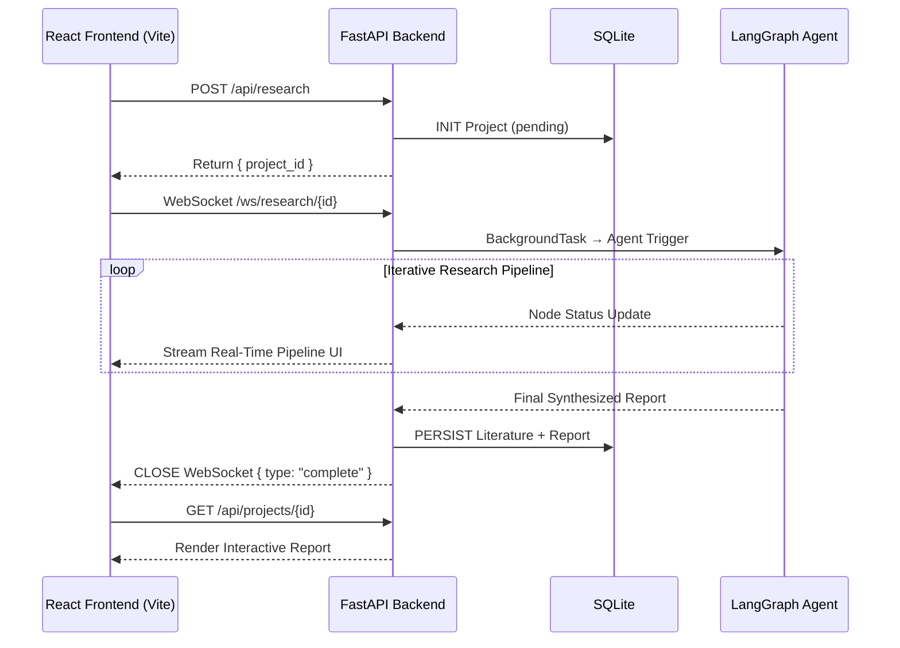

<div align="center">


# 🎓 Scholar-Agent
**The Agentic Research Assistant Powered by LangGraph**

[](https://www.python.org/downloads/)
[](https://fastapi.tiangolo.com/)
[](https://reactjs.org/)
[](https://langchain-ai.github.io/langgraph/)
[](https://www.docker.com/)
[](https://www.gnu.org/licenses/gpl-3.0)

[English](README.md) • [简体中文](README_zh.md)

<p align="center">
    <strong>Scholar-Agent is an advanced open-source AI assistant designed to automate tedious literature review.</strong>
    <br />
    It retrieves, filters, and analyzes academic papers from arXiv and Zotero to provide quantitative, SOTA research insights.
</p>
</div>

---

## 📺 Feature & Demo Video

**Watch the full introduction video on Bilibili:**

[](https://www.bilibili.com/video/BV1AmwxzPEBF)

<div align="center">
  
  <br />
  <i>Real-time Agent Tracking: Watch every step of the reasoning pipeline via WebSockets</i>
</div>

---

## ✨ Core Features

- 🧠 **Multi-Agent Workflow**: Orchestrated by LangGraph. Handles intent parsing, Zotero querying, arXiv cloud search, query expansion, paper filtering, and LLM technical benchmark synthesis.
- ⚡ **Real-Time Kanban Tracking**: Modern React/Vite frontend visualizing Agent execution state in real-time through WebSockets.
- 💾 **SQLite Persistence & Dashboard**: Automatically stores project configurations, aggregated literature, and generated Markdown reports for future reference.
- 📄 **RAG & OCR Integration**: Leverages [Docling](https://github.com/DS4SD/docling) for robust PDF-to-Markdown conversion, effectively handling complex scientific tables and equations with OCR fallback.
- 🐳 **One-Click Deployment**: Perfectly containerized using Docker Compose for instant full-stack spin up.

---

## 🏗️ Architecture



---

## 🚀 Quick Start (Docker)

The fastest and most reliable way to spin up the entire Scholar-Agent stack is via Docker.

### 1. Configure Environment
```bash
# Copy the example environment file
cp .env.example .env

# Edit .env and append your LLM keys (e.g., Qwen API Key)
# QWEN_API_KEY=sk-your-key-here
```

### 2. Launch Stack
```bash
docker-compose up --build
```

**That's it!** Navigate to **[http://localhost:3000](http://localhost:3000)** to access the Scholar-Agent dashboard.

---

## 💻 Local Development

If you prefer to run the components directly on your host machine for development:

### Prerequisites
- Python 3.11+
- Node.js v18+

### Backend (FastAPI + LangGraph)
Open a terminal targeting the `backend` folder:
```bash
cd backend
python -m venv venv
# Windows: venv\Scripts\activate
# Unix/Mac: source venv/bin/activate

pip install -r requirements.txt
cp .env.example .env

# Start the API server on port 8000
uvicorn server:app --reload --port 8000
```

### Frontend (React + Vite)
Open a new terminal targeting the `frontend` folder:
```bash
cd frontend
npm install

# Start the dev server on port 3000
npm run dev
```

---

## ⚙️ Key Configuration Options

Located centrally in your `.env` file:

| Variable | Description |
|---|---|
| `QWEN_API_KEY` | Connect to Alibaba Cloud LLM services natively. |
| `SELECTED_MODEL_NAME` | The default reasoning model (e.g., `qwen2.5-32b-instruct` or `qwen3.5-flash`). |
| `ZOTERO_BBT_PULL_URL` | Sync with your local academic tracking system (Requires Zotero Better BibTeX plugin). |
| `USE_OCR` | Set to `1` to force CPU/GPU-based OCR (RapidOCR) during PDF chunking parsing for embedded charts. |

---

<div align="center">
Made with ❤️ for Researchers. Accelerating Science with AI.
</div>
