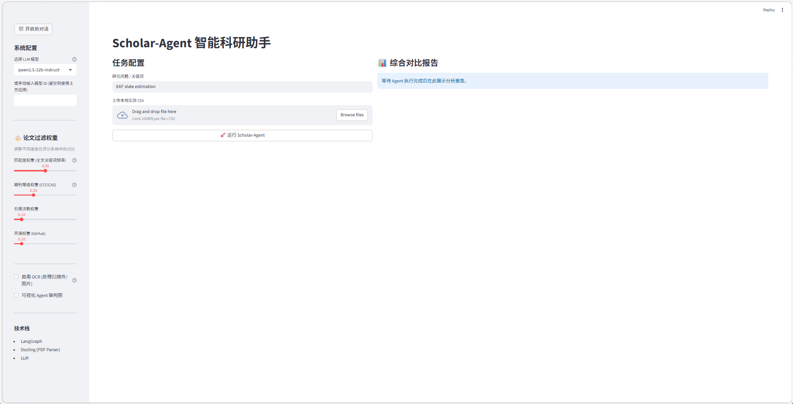
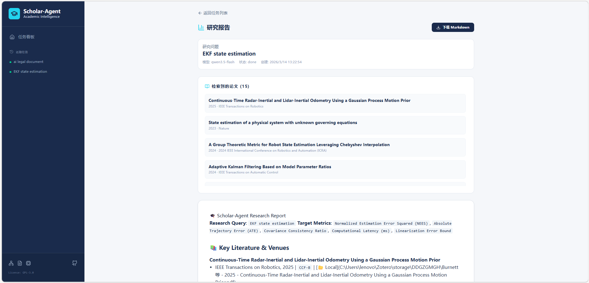
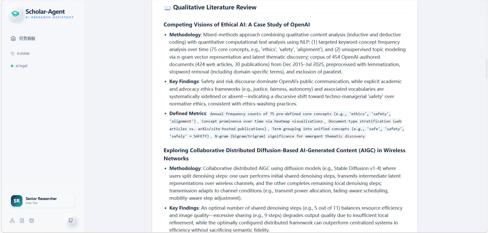
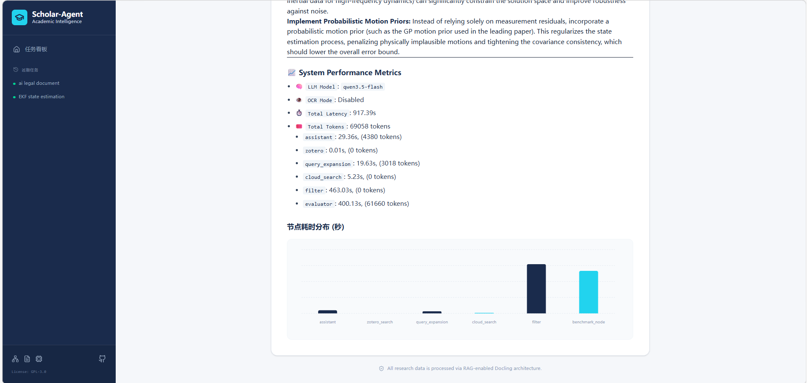

<div align="center">


# 🎓 Scholar-Agent
**基于 LangGraph 的全自动学术研究助理**

[](https://www.python.org/downloads/)
[](https://fastapi.tiangolo.com/)
[](https://reactjs.org/)
[](https://langchain-ai.github.io/langgraph/)
[](https://www.docker.com/)
[](https://www.gnu.org/licenses/gpl-3.0)

[English](README.md) • [简体中文](README_zh.md)

<p align="center">
    <strong>Scholar-Agent can automatically retrieve, filter, and analyze cutting-edge research papers from the web and your local Zotero library, extracting quantified state-of-the-art (SOTA) comparison data and technical recommendations.</strong>
</p>
</div>

---

## 📺 演示视频与界面截图

**点击前往 Bilibili 观看完整使用教程:**

[](https://www.bilibili.com/video/BV1AmwxzPEBF)

<div align="center">
  
  <br />
  <i>Real-time Agent Tracking: Watch every step of the reasoning pipeline via WebSockets</i>
</div>

---

<div align="center">
  
  <br />
</div>

---

<div align="center">
  
  <br />
</div>

---

<div align="center">
  
  <br />
</div>

---

## 🚀 极速启动 (Docker)

### 1. 环境变量配置
```bash
# Copy the default environment variable template  
cp .env.example .env
```
---

## ⚙️ 核心环境变量说明

All core configuration settings are centralized in the `.env` configuration file located in the `backend` directory:

| Variable | Description |
|---|---|
| `OPENAI_API_KEY` | OpenAI Official API Key, used to drive core Agent decision-making and reasoning logic. |
| `ZOTERO_API_KEY` | Zotero Personal Account API Key, used to remotely read literature library data.|
| `ZOTERO_USER_ID` | Your Zotero User ID, used to locate specific personal/group libraries. |
| `EXPERIMENT_CSV_PATH` | Used to specify the storage directory of the generated quantitative analysis CSV file. (Optional) |
---

## 2.  本地开发环境设置

Start the backend and frontend separately:

### 依赖要求
- Python 3.11 and above
- Node.js v18 and above

### 后端核心 (FastAPI + LangGraph)
First, enter the `backend` directory:
```bash
cd backend
python -m venv venv （Only run when starting for the first time）
pip install -r requirements.txt （Only run when starting for the first time）
uvicorn server:app --reload --port 8000
```

### 前端看板 (React + Vite)
Open a **new terminal** and enter the `frontend` directory:
```bash
cd frontend
npm install （Only run when starting for the first time）
npm run dev
```

---

## 3.  运行scholar-agent

Now open your browser and visit **[http://localhost:3000](http://localhost:3000)** to start using the platform.
---

<div align="center">
Made with ❤️ for Researchers. Accelerating the progress of science with artificial intelligence.
</div>
