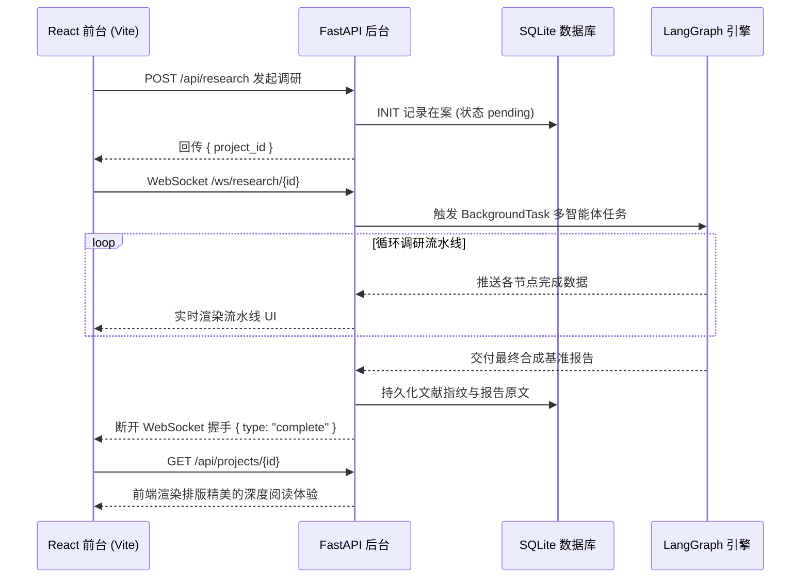

<div align="center">


# 🎓 Scholar-Agent
**基于 LangGraph 的全自动学术研究助理**

[](https://www.python.org/downloads/)
[](https://fastapi.tiangolo.com/)
[](https://reactjs.org/)
[](https://langchain-ai.github.io/langgraph/)
[](https://www.docker.com/)
[](https://www.gnu.org/licenses/gpl-3.0)

[English](README.md) • [简体中文](README_zh.md)

<p align="center">
    <strong>Scholar-Agent 是一个先进的学术辅助开源项目，旨在自动化繁琐的文献综述与基准对齐工作。</strong>
    <br />
    它可以从 arXiv 和 Zotero 自动检索、过滤并分析前沿论文，提炼量化的 SOTA 对比数据与技术建议。
</p>
</div>

---

## 📺 演示视频与界面截图

**点击前往 Bilibili 观看完整使用教程:**

[](https://www.bilibili.com/video/BV1iacUzUEE1)

<div align="center">
  
  <br />
  <i>实时工作流跟踪：通过 WebSocket 在前端直观地观察智能体的每一个思考步骤</i>
</div>

---

## ✨ 核心特性

- 🧠 **多智能体工作流 (Multi-Agent)**: 基于 LangGraph 编排。系统涵盖了意图分析、Zotero 本地查询、arXiv 云端检索、学术查词扩展、加权筛选以及大模型技术分析等独立 Agent 节点。
- ⚡ **实时看板与追踪**: 采用现代化 React/Vite 前端，并利用 WebSocket 技术，无延迟将后端的节点状态推送到前端 UI 进行可视化。
- 💾 **SQLite 持久化管理**: 全自动记录所有调研实验。可随时在历史任务面板中查看任务词云、抓取的论文列表、评分细则及最终生成的 Markdown 分析报告。
- 📄 **RAG 与 OCR 软着陆提取**: 集成了 [Docling](https://github.com/DS4SD/docling) 解析引擎，对 PDF 能够保留高质量 Markdown 层级。遇到硬解码失败或扫描件时，将自动降级进入 RapidOCR 图像识别模式提取表格和数值。
- 🐳 **Docker 一键满血部署**: 提供开箱即用的 Docker Compose 配置，零环境烦恼。

---

## 🏗️ 系统架构设计



---

## 🚀 极速启动 (Docker)

使用 Docker Compose 是启动并体验该项目最稳妥、最快捷的方式。

### 1. 环境变量配置
```bash
# 拷贝预设的环境变量模板
cp .env.example .env

# 编辑 .env 文件，填写你的大模型 API Key（必填项，例如使用通义千问）
# QWEN_API_KEY=sk-your-key-here
```

### 2. 构建与运行容器
```bash
docker-compose up --build
```

**就这么简单！** 现在请打开浏览器并访问 **[http://localhost:3000](http://localhost:3000)**，即可开始使用该平台。

---

## 💻 本地开发环境设置

如果你准备对此项目进行二次开发，可将后端和前端分别在裸机部署启动：

### 依赖要求
- Python 3.11 及以上版本
- Node.js v18 及以上版本

### 后端核心 (FastAPI + LangGraph)
首先进入 `backend` 目录：
```bash
cd backend
python -m venv venv
# Windows 激活: venv\Scripts\activate
# Unix/Mac 激活: source venv/bin/activate

pip install -r requirements.txt
cp .env.example .env

# 启动 8000 端口服务
uvicorn server:app --reload --port 8000
```

### 前端看板 (React + Vite)
打开一个**全新的终端**并进入 `frontend` 目录：
```bash
cd frontend
npm install

# 启动 3000 端口开发服务器
npm run dev
```

---

## ⚙️ 核心环境变量说明

所有的核心配置项均集中在项目根目录（或 `backend` 目录）的 `.env` 配置文件中：

| 变量键值 | 功能说明 |
|---|---|
| `QWEN_API_KEY` | 用于对齐分析与提示词解析的阿里云模型鉴权 Key。 |
| `SELECTED_MODEL_NAME` | 全局指向的默认思考引擎 (例如：`qwen2.5-32b-instruct` 或 `qwen3.5-flash`)。 |
| `ZOTERO_BBT_PULL_URL` | 与你本地学术追踪流集成的 API 地址 (需安装 Better BibTeX 插件)。 |
| `USE_OCR` | 若置为 `1`，解析含图 PDF 时将切入由 CPU/GPU 加速的强行版式识别 (耗内存稍大)。 |

---

<div align="center">
Made with ❤️ for Researchers. 用人工智能加速人类科学进程。
</div>
