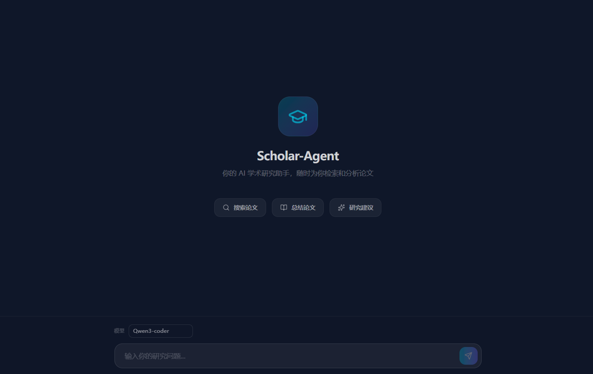

<div align="center">


# 🎓 Scholar-Agent
**对话式 AI 学术研究助手**

[](https://www.python.org/downloads/)
[](https://fastapi.tiangolo.com/)
[](https://reactjs.org/)
[](https://langchain-ai.github.io/langgraph/)
[](https://www.gnu.org/licenses/gpl-3.0)

[English](README.md) • [简体中文](README_zh.md)

<p align="center">
    <strong>Scholar-Agent 是一个支持多轮对话、自主调用的 AI 学术助理。它借鉴了 OpenClaw 的架构思想，采用“中控大模型 + 专项 Skill”的设计，能够自动检索文献、阅读全文并与你进行深度的学术探讨。</strong>
</p>
</div>

---

## ✨ 核心特性 (V2.0)

- 💬 **多轮对话能力**：类 ChatGPT 的对话式交互，让研究过程更自然。
- 🤖 **中控大模型 (Manager)**：基于 Tool Calling 自主决定何时搜索论文、何时阅读全文或直接回答。
- 🔍 **学术搜索 Skill**：集成了 LangGraph 流水线，支持从 arXiv 和 Zotero 自动检索、过滤并评分高质量论文。
- 📖 **深度阅读 Skill**：一键提取并分析已检索论文的全文内容，支持侧边栏详情展示。
- 🗂️ **持久化知识库**：会话级论文缓存，支持多轮对话中的上下文关联与引用。
- 🔢 **智能引用机制**：AI 自动为发现的论文分配编号 `[1]`, `[2]`...，方便你在后续对话中随时点名分析。

---

## 📺 演示与界面截图


<div align="center">
  
  <br />
  <i>现代化对话界面：支持侧边栏会话管理、聊天流与论文详情面板</i>
</div>

---

## 🚀 快速启动

### 1. 环境变量配置
```bash
# 拷贝预设的环境变量模板
cp .env.example .env
```

### ⚙️ 核心环境变量说明
请在 `backend/.env` 中配置核心环境变量

---

## 2. 本地环境设置

### 第一步：启动 Redis (终端 1)
```powershell
cd redis
.\redis-server.exe
```

### 第二步：启动后端网关 (终端 2)
```powershell
cd backend
.\venv\Scripts\Activate.ps1
python -m uvicorn server:app --reload
```
🔔 **成功标志**：显示 `Uvicorn running on http://127.0.0.1:8000`

### 第三步：启动 Celery 运算节点 (终端 3)
负责后台的论文搜索与 PDF 处理。
```powershell
cd backend
.\venv\Scripts\Activate.ps1
celery -A celery_app worker --loglevel=info --pool=solo
```

### 第四步：启动前端界面 (终端 4)
```powershell
cd frontend
npm install
npm run dev
```
🔔 **成功标志**：显示 `VITE v6.x.x ready` 并提供访问链接 `http://localhost:3000/`。

---

## 3. 开始使用

1. 浏览器访问 **[http://localhost:3000](http://localhost:3000)**。
2. 点击 **"新建对话"** 开启研究任务。
3. 尝试输入：*"帮我搜索关于 Transformer 效率优化的最新论文"* 或 *"详细解释一下第 2 篇论文的方法论"*。

---