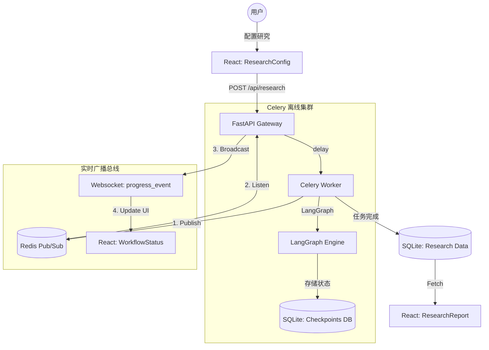

# Scholar-Agent 开发者上手地图 🗺️

这份地图旨在帮助你快速理解项目的全貌，明确哪些文件是由你（开发者）维护的核心逻辑，哪些是 AI 生成的辅助性工程代码。本次架构升级引入了 **Celery + Redis** 异步处理与 **SqliteSaver** 状态持久化。

---

## 1. 核心文件清单 (The "Must-Read")

| 文件路径 | 职责类型 | 关键作用 |
| :--- | :--- | :--- |
| **[backend/main.py](file:///c:/Users/lenovo/Desktop/scholar-agent/backend/main.py)** | **工作流编排** | 定义了 Agent 的 LangGraph 拓扑结构。现包含 `SqliteSaver` 用于状态持久化，支持任务中断恢复。 |
| **[backend/tasks.py](file:///c:/Users/lenovo/Desktop/scholar-agent/backend/tasks.py)** | **计算核心** | **(新增)** Celery 任务定义。Agent 的重逻辑目前在这里异步执行，脱离了 FastAPI 进程以提高高可用性。 |
| **[backend/server.py](file:///c:/Users/lenovo/Desktop/scholar-agent/backend/server.py)** | **API 网关** | FastAPI 入口。负责接收请求、派发 Celery 任务，并通过 Redis Pub/Sub 监听消息并广播 WebSocket。 |
| **[backend/models_config.py](file:///c:/Users/lenovo/Desktop/scholar-agent/backend/models_config.py)** | **配置中心** | **(新增)** 统一管理前端与后端共用的 AI 模型列表，修改一处即可全局生效。 |
| **[backend/src/nodes/filter_node.py](file:///c:/Users/lenovo/Desktop/scholar-agent/backend/src/nodes/filter_node.py)** | **核心逻辑** | **(逻辑重点)** 负责文献评分（分区、引用、相关性）。现已优化 Docling 内存占用，防止 OOM。 |
| **[frontend/src/App.tsx](file:///c:/Users/lenovo/Desktop/scholar-agent/frontend/src/App.tsx)** | **路由调度** | 控制界面切换。现支持根据项目状态（Running/Done）自动寻找正确的视图（Workflow/Report）。 |

---

## 2. 模块作用与生命周期 (Module Lifecycle)

项目执行可以分为四个主要阶段，各核心文件在其中的作用如下：

### 阶段 A: 任务提交 (Task Submission)
*   **[frontend/src/components/ResearchConfig.tsx](file:///c:/Users/lenovo/Desktop/scholar-agent/frontend/src/components/ResearchConfig.tsx)**: 用户配置研究参数。UI 已精调，支持 OCR 与 Benchmark 开关。
*   **[backend/server.py](file:///c:/Users/lenovo/Desktop/scholar-agent/backend/server.py)**: `/api/research` 接收请求，将任务 ID 派发给 Celery 队列（`run_research_task.delay()`）。

### 阶段 B: 异步研析 (Asynchronous Processing)
*   **[backend/tasks.py](file:///c:/Users/lenovo/Desktop/scholar-agent/backend/tasks.py)**: Celery Worker 启动！它调用 `main.py` 里的 LangGraph 引擎。
*   **[backend/src/nodes/](file:///c:/Users/lenovo/Desktop/scholar-agent/backend/src/nodes/)**: 各节点 (Search, Filter, Evaluator) 顺序执行。
*   **[backend/main.py](file:///c:/Users/lenovo/Desktop/scholar-agent/backend/main.py)**: `SqliteSaver` 实时将每个节点的计算结果写入 `scholar_agent_checkpoints.db`。

### 阶段 C: 实时反馈 (Real-time Feedback)
*   **Pub/Sub 总线**: Worker 在 `tasks.py` 中向 Redis 频道 `ws_project_{id}` 发送状态，`server.py` 里的广播协程监听并推送到前端。
*   **状态恢复**: **[frontend/src/components/WorkflowStatus.tsx](file:///c:/Users/lenovo/Desktop/scholar-agent/frontend/src/components/WorkflowStatus.tsx)** 在页面加载时会自动从后端拉取“最后一次缓存状态”，实现断连重连后的进度条“快进”恢复。

### 阶段 D: 结果持久化与渲染 (Persistence & UI)
*   **[backend/tasks.py](file:///c:/Users/lenovo/Desktop/scholar-agent/backend/tasks.py)**: 任务圆满完成后，由 Worker 将最终报告写入 SQLite。
*   **[frontend/src/components/ResearchReport.tsx](file:///c:/Users/lenovo/Desktop/scholar-agent/frontend/src/components/ResearchReport.tsx)**: 渲染 Markdown 报告，支持通过 `PaperChat` 针对单篇论文进行 AI 深度对谈。

---

## 3. 前端与后端异步联调链路 (Request Flow)

| 环节 | 组件/接口 | 技术细节 |
| :--- | :--- | :--- |
| **1. 点击启动** | [ResearchConfig.tsx](file:///c:/Users/lenovo/Desktop/scholar-agent/frontend/src/components/ResearchConfig.tsx) | 发送 POST 请求。 |
| **2. 任务入队** | `tasks.run_research_task` | 状态变为 `pending`，进入 Celery/Redis 队列。 |
| **3. 进度推送** | `Redis.publish` | Worker 算出结果后通知 Redis。 |
| **4. 网关广播** | `manager.broadcast` | `server.py` 将 Redis 消息转给所有已连上该项目的端。 |
| **5. 状态同步** | [App.tsx](file:///c:/Users/lenovo/Desktop/scholar-agent/frontend/src/App.tsx) | 你随时离开任务页再点回来，App 会根据 `status: running` 自动跳回 `WorkflowStatus`。 |

### 架构流程图 (Mermaid)



---

> 1. 第一步：确保 Redis 已启动 (基石)
>
>    ```
>    cd redis
>    Start-Process .\redis-server.exe
>    cd ..
>    ```
>
>    ------
>
>    ### 第二步：开启 FastAPI 纯接口网关 (终端 1)
>
>    这是所有 API 的收发枢纽。
>
>    ```
>    # 1. 进入后端目录
>    cd backend
>    
>    # 2. 激活虚拟环境
>    .\venv\Scripts\Activate.ps1
>    
>    # 3. 开启服务
>    python -m uvicorn server:app --reload
>    ```
>
>    🔔 成功标志：显示 `Uvicorn running on http://127.0.0.1:8000`
>
>    ------
>
>    ### 第三步：开启 Celery 运算集群 (终端 2)
>
>    这是重构后的核心，专门吃并发、吃显存，负责啃大篇幅的 PDF。
>
>    ```
>    # 1. 同样进入后端目录
>    cd backend
>    
>    # 2. 必须重开一个虚拟环境
>    .\venv\Scripts\Activate.ps1
>    
>    # 3. 开启工作节点（注意Windows必须要加 --pool=solo）
>    celery -A celery_app worker --loglevel=info --pool=solo
>    ```
>
>    🔔 成功标志：显示金字塔形状的 `[celery@...] ready.`
>
>    ------
>
>    ### 第四步：开启漂亮的前端界面 (终端 3)
>
>    这一步负责给用户渲染带动画、带对话框的最终界面。
>
>    ```
>    # 1. 进入前端目录
>    cd frontend
>    
>    # 2. 安装依赖（如果之前没安装过就运行一次）
>    npm install
>    
>    # 3. 运行本地开发服务器
>    npm run dev
>    ```
>
>    🔔 成功标志：显示 `VITE v5.x.x ready in ...` 以及访问链接 `http://localhost:5173/` (或类似链接)。
>
>    ------
>
>    🎉 **最后：** 打开您的浏览器，输入前端控制台打印的地址（通常是 **[http://localhost:5173](http://localhost:5173/)** 或者有时是 **[http://localhost:3000](http://localhost:3000/)** ），您就可以在这个现代化的高可用微服务架构上，发起几十页长篇文献的研究任务了！

